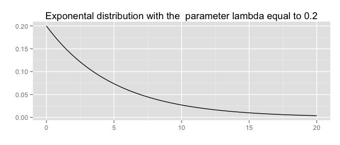
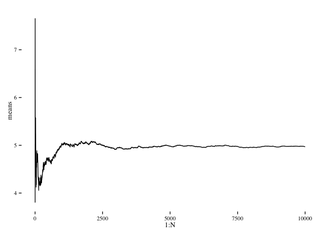
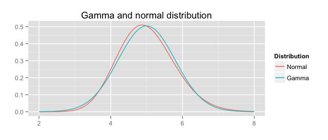
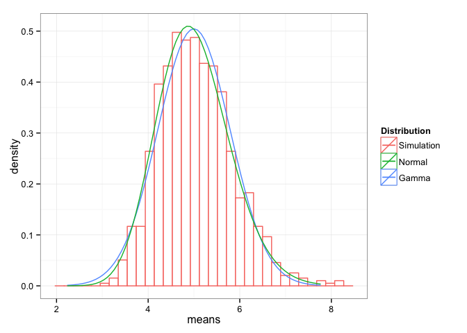
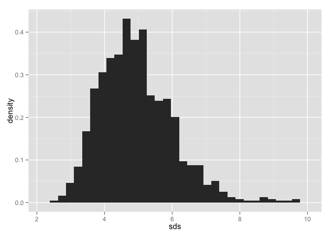

# Exponential vs. Normal distribution (through CLT)
Bartek Skorulski  

Exponential vs. Normal distribution (through CLT)
-------------------------------------------------


```r
require("knitr")
```

```
## Loading required package: knitr
```

```r
require("markdown")
```

```
## Loading required package: markdown
```

```r
require("ggplot2")
```

```
## Loading required package: ggplot2
```


## Exponential distribtion

_Exponential distriubution_ is given by the formula:
\[f(x)=\lambda e^{-\lambda x},\]
for $\lambda>0$ where $x\geq 0$. Its
mean is $\lambda^{-1}$, and its variance is $1/\lambda^2$. 


```r
x <- seq(0,20,0.1)
lambda <- 0.2
ggplot() + geom_path(aes(x,dexp(x,lambda)))+labs(x="",y="") +
    labs(title="Exponental distribution with the  parameter lambda equal to 0.2")
```

 

### Sample mean and variance

First we see how the sample mean and variannce approximate the
theoretical ones.


```r
N <- 10000
set.seed(1000)
exps <- rexp(N,lambda)
means <- sapply(1:N, function(n) mean(exps[1:n]))
vars <- sapply(1:N, function(n) var(exps[1:n]))

require("ggthemes")
```

```
## Loading required package: ggthemes
```

```
## Warning: package 'ggthemes' was built under R version 3.1.3
```

```r
ggplot()+geom_line(aes(1:N, means))+theme_tufte()
```

 

## Sum of independent random variable with exponential distribution

Exponential distribution is a special case of
_gamma distribution_
\[  f_{\alpha, \nu}(x) = \frac{1}{\Gamma(\nu)}\alpha^\nu x^{\nu-1}e^{-\alpha x}, \nu>0, x>0.\]
when $\nu =1$. Let us also recall that:
\[  \Gamma(t) = \int_0^\infty x^{t-1}e^{-x}dx.\]

It is also worth noting that if $X_1$ and $X_2$ are two independent
random variable
that have gamma distribution respectively $f_{\alpha,\mu}$,
$f_{\alpha,\nu}$ with the same parameter $\alpha$, then
the sum $X_1+X_2$ has the distribution $f_{\alpha,\mu+\nu}$. Hence
sum $k$ of identicaly distributed random variables with expotential
distribribution is a gamma distribution $f_{\alpha, k}$. Moreover, if
$X$ is a Gamma distribution with a parametrs $\lambda, \nu$, then $X/k$ is
Gamma distribution with paramenter $k\lambda, \nu$.
Therefore, the density of $(X_1+\ldots+X_k)/k$ is $f_{k\lambda,k}$.

<!--
     dgamma(x, shape, rate = 1, scale = 1/rate, log = FALSE)

The Gamma distribution with parameters ???shape??? = a and ???scale??? = s
    has density
    
f(x)= 1/(s^a Gamma(a)) x^(a-1) e^-(x/s)

-->

```r
x <- seq(2,8,0.01)
k <- 40
e40.m <- lambda^{-1}
e40.sd <- lambda^{-1}/sqrt(40)
ggplot()+geom_path(aes(x,dgamma(x, shape= k, rate = k*lambda), colour="blue"))+
    geom_path(aes(x=x, y = dnorm(x, e40.m, e40.sd), colour="red") )+
        labs(x="", y="", title="Gamma and normal distribution")+
                 scale_colour_discrete(name  ="Distribution",
                                       labels=c("Normal", "Gamma"))
```

 

## Simulation


```r
N <- 1000
require("data.table")
```

```
## Loading required package: data.table
```

```r
means <- c()
sds <- c()
set.seed(10)
for (n in 1:N) {
  exps <- rexp(k, lambda)
  means <- c(means,mean(exps))
  sds <- c(sds, sd(exps))
}
e40.dt <- data.table(means=means)
x <- seq(e40.m-3.5*e40.sd,e40.m+3.5*e40.sd,e40.sd/10)
ggplot()+geom_histogram(data=e40.dt,aes(x=means, y=..density..,colour="black"),
                        fill="white")+
    geom_path(aes(x=x, y = dnorm(x, e40.m, e40.sd),colour="red"))+theme_bw()+
        geom_path(aes(x,k*dgamma(k*x, shape= k, scale = 5), colour="blue"))+
            scale_colour_discrete(name  ="Distribution",
                                  labels=c("Simulation","Normal", "Gamma"))
```

```
## stat_bin: binwidth defaulted to range/30. Use 'binwidth = x' to adjust this.
```

 

If $X$ is an exponential distribution then, since $X>0$,
$P(X^2<r)=F(\sqrt(r))$, the density of $X^2$ is \[
f_{X^2}(x)=\frac{f(x)}{2\sqrt(x)}=
\frac{\lambda\cdot x^{\frac{1}{2}-1}e^{-\lambda x}}{2}=f_{\lambda,0.5}.
\]
Then $X_1^2+\ldots+X_k^2$ has density $f_{\lambda, k/2}$, and
$(X_1^2+\ldots+X_k^2)/n$, $f_{n\lambda, k/2}$. 

If $X$ is a normal distribution 


```r
ggplot()+geom_histogram(data=e40.dt,aes(x=sds, y=..density..))
```

```
## stat_bin: binwidth defaulted to range/30. Use 'binwidth = x' to adjust this.
```

 

