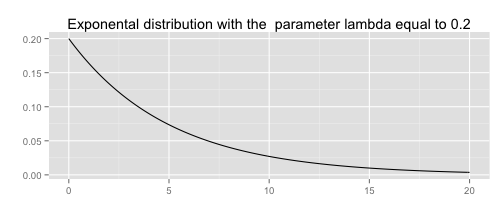

Exponential vs. Normal distribution (through CLT)
-------------------------------------------------


```r
require("knitr")
require("ggplot2")
```


## Exponential distribtion

\[f(x)=\lambda e^{-\lambda x},\]

for $\lambda>0$ where $x\geq 0$. Mean is $\lambda^{-1}$, and standard
deviation is also $\lambda^{-1}$.


```r
x <- seq(0,20,0.1)
ggplot()+geom_path(aes(x,dexp(x,0.2)))
```

 


```r
lambda <- 0.2
k <- 40
N <- 1000
e40.m <- lambda^{-1}
e40.sd <- lambda^{-1}/sqrt(40)
require("data.table")
means <- c()
sds <- c()
for (n in 1:N) {
  exps <- rexp(k, lambda)
  means <- c(means,mean(exps))
  sds <- c(sds, sd(exps))
}
e40.dt <- data.table(means=means)
x <- seq(e40.m-3*e40.sd,e40.m+3*e40.sd,e40.sd/10)
ggplot()+geom_histogram(data=e40.dt,aes(x=means, y=..density..))+
    geom_path(aes(x=x, y = dnorm(x, e40.m, e40.sd)))
```

```
## stat_bin: binwidth defaulted to range/30. Use 'binwidth = x' to adjust this.
```

 


```r
ggplot()+geom_histogram(data=e40.dt,aes(x=sds, y=..density..))
```

```
## stat_bin: binwidth defaulted to range/30. Use 'binwidth = x' to adjust this.
```

 
